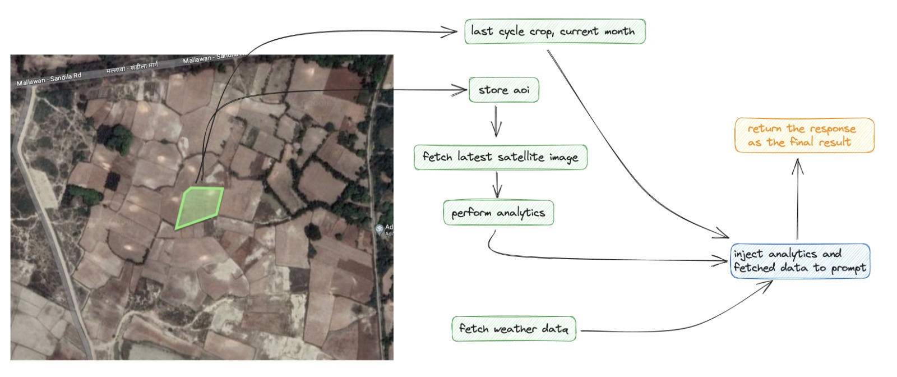

# GrowWise

### Introduction
Farmers across India face challenges like limited access to information, dependence on traditional farming techniques, limited access to products in the market. Industries like Aqua Culture, Dairy Culture, and other farming industries have on-ground technicians and domain experts to help farmers in the domain, but no such facilities are available for agri farmers yet. With GrowWise we introduce a smart assistant for farmers that helps them understand which crop to grow given the status of their farm.

### How GrowWise works
GrowWise uses open-source satellite imagery to generate insights like moisture content, bare soil content, and other important parameters for a given farm. Using the geolocation of the farm, we fetch the weather data for the region. We then combine the farm parameters, weather data, and other data provided by the farmers to determine suitable crops that can be grown in the coming seasons. Chat GPT is used to determine the suitable crops, and additional reasons are also provided for why a crop is suitable or not. We also scrape the internet to provide the farmer with links for the products that can be used for farming. With the initial version of GrowWise, we aim to solve the pre-farming issues for farmer, helping them with decision making, logistic support for farm equipment.

  

### How to use:
- Select a farm in the marked area
- Provide the following details:
  - Last crop grown
  - Current month
  - Irrigation source
- Press submit and wait for the response